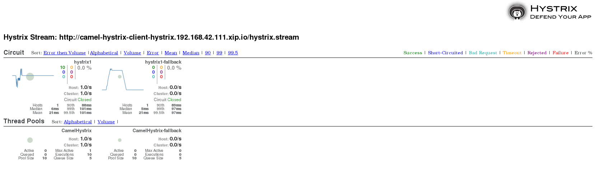

# Hystrix Example

This example is based on [camel-example-hystrix](https://github.com/apache/camel/tree/master/examples/camel-example-hystrix)

### Introduction

This example shows how to use Camel with Hystrix EIP as circuit breaker in Camel routes

The example includes three sub maven modules that implement

- client
- service1
- service2

Where client -> service1
      client -> service2 (fallback)

### Configuration

Service1 is configured in the `src/main/java/sample/camel/Service1Application.java` source code.
Service2 is configured in the `src/main/resources/application.properties` properties file.

### Run on OpenShift

Then using three different shells and run service1 and service2 before the client.

```sh
$ cd service1
$ mvn clean install fabric8:deploy -Dfabric8.deploy.createExternalUrls=true fabric8:log
```

When service1 is ready then start service2

```sh
$ cd service2
$ mvn clean install fabric8:deploy -Dfabric8.deploy.createExternalUrls=true fabric8:log
```

And then start the client.

```sh
$ cd client
$ mvn clean install fabric8:deploy -Dfabric8.deploy.createExternalUrls=true fabric8:log
```

In order to configure the url of service1 & service2,
First you should list all the route on your project:

```sh
$ oc get route
NAME                     HOST/PORT                                              PATH      SERVICES                 PORT      TERMINATION
camel-hystrix-client     camel-hystrix-client-hystrix.192.168.42.111.xip.io               camel-hystrix-client     <all>
camel-hystrix-service1   camel-hystrix-service1-hystrix.192.168.42.111.xip.io             camel-hystrix-service1   <all>
camel-hystrix-service2   camel-hystrix-service2-hystrix.192.168.42.111.xip.io             camel-hystrix-service2   <all>
hystrix-dashboard        hystrix-dashboard-hystrix.192.168.42.111.xip.io                  hystrix-dashboard        <all>
```

Then, you can update the url of service1 & service2 by updating the following env variable:

```sh
oc env dc/camel-hystrix-client CAMEL_HYSTRIX_URL="http://camel-hystrix-service1-hystrix.192.168.42.111.xip.io/service1"
oc env dc/camel-hystrix-client CAMEL_FALLBACK_URL="http://camel-hystrix-service2-hystrix.192.168.42.111.xip.io/service2"
```

Check that client is started:

```sh
mvn fabric8:log
```

The client calls service1 every second.
You can then stop service1 (oc delete pods <pod_id_service1>) and see that the client should fallback to call service2 in the Hystrix EIP circuit breaker.
And then start service 1 again and see the Hystrix EIP go back to normal.

### Hystrix Dashboard

To run this example on OpenShift, first you should build the Docker images for all components and have them available locally on OpenShift master.
To build the images, you can take advantage of [docker-maven-plugin](https://github.com/fabric8io/docker-maven-plugin) to build a Docker image for each project.
Run the following in the root project:
```sh
	$ mvn install docker:build
```
Now that the images are ready, import the OpenShift template hystrix-dashboard.json and create an application based on the imported template:

```sh
	$ oc create -f hystrix-dashboard.json
	$ oc new-app hystrix-dashboard
```

A number of objects for the services and components are created within the project:

```sh
	--> Deploying template hystrix-dashboard for "hystrix-dashboard"
	--> Creating resources ...
	    Service "hystrix-dashboard" created
	    Route "hystrix-dashboard" created
	    DeploymentConfig "hystrix-dashboard" created
	--> Success
	    Run 'oc status' to view your app.
```

Hystrix Dashboard shows the status of Hystrix commands being run and the circuit state (close or open) on each endpoint.
Enter hystrix's stream url in Hystrix Dashboard and then click _Add Stream_ and _Monitor Streams_:
The stream is accessible from the client at: `Hystrix Stream: http://camel-hystrix-client-hystrix.192.168.42.111.xip.io/hystrix.stream`.

In the screen shot below, we have just stopped the pods of service1 (oc delete pods <pod_id>), so
the Hystrix EIP will execute the fallback via network, which is calling service2 instead.



The Camel riders!